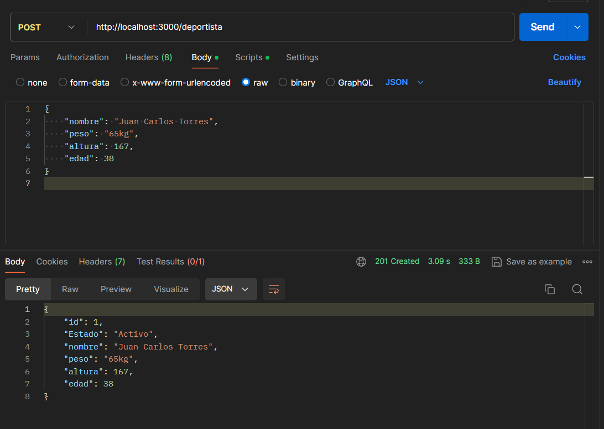
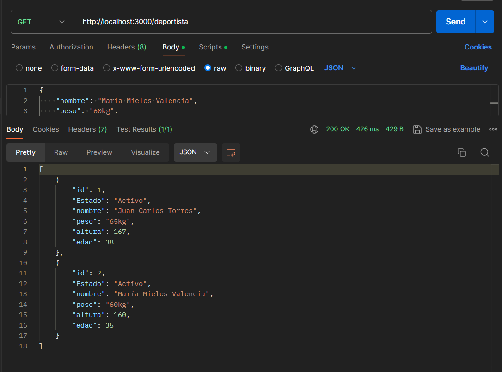
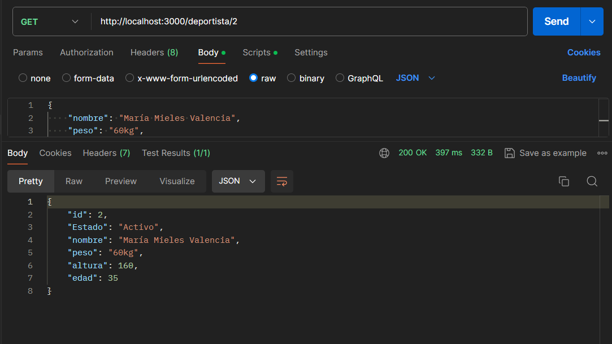
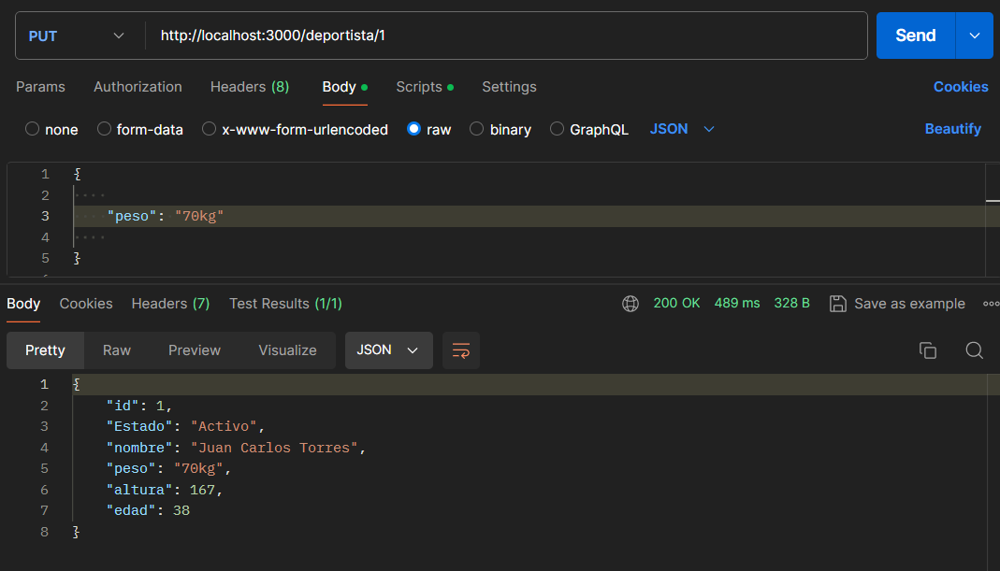
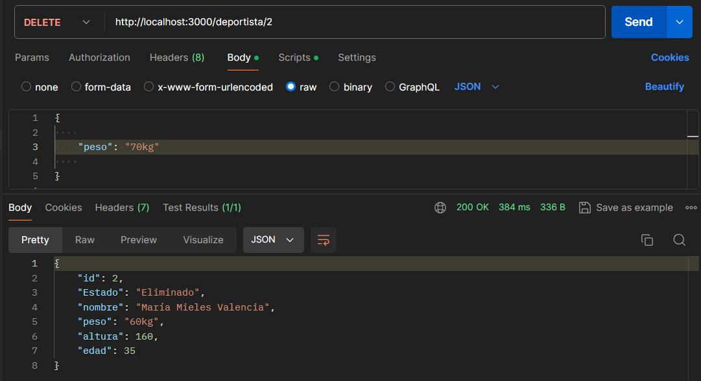

#Prueba de la API.
##ENDPOINTS.
###Crear un nuevo deportista.
**Con metodo**:POST
**URL**:http://localhost:3000/deportista

###Obtener todos los deportistas.
**Con metodo**:GET
**URL**:http://localhost:3000/deportista

###Obtener deportistas por su id.
**Con metodo**:GET
**URL**:http://localhost:3000/deportista/2

###Actualizar deportista.
**Con metodo**:PUT
**URL**:http://localhost:3000/deportista/1

###Eliminar deportista.
**Con metodo**:DELETE
**URL**:http://localhost:3000/deportista/2
